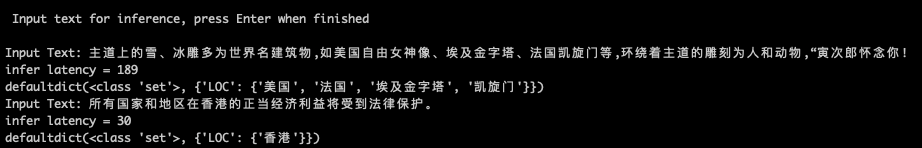
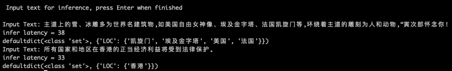

# 中文NER的那些事儿

The code is not rigorously tested, if you find a bug, welcome PR ^_^ ~

### 支持模型
1. 字符输入单任务:
bilstm_crf，bert_ce，bert_crf，bert_bilstm_crf，bert_cnn_crf，bert_bilstm_crf_bigram
  
2. 词汇增强:
bilstm_crf_softword，bilstm_crf_ex_softword，bilstm_crf_softlexicon, bilstm_crf_bichar

3. 多任务
- bert_bilstm_crf_mtl: 共享Bert的多任务联合学习
- bert_bilstm_crf_adv: 对抗迁移联合学习

4. Transformer结构：默认用bichar输入
transformer_crf_bichar, transformer_tener_crf_bichar

5. 数据增强：data/people_daily_augment

### 训练&评估
1. pretrain_model中下载对应预训练模型到对应Folder，具体详见Folder中README.md
2. data中运行对应数据集preprocess.py得到tfrecord和data_params，训练会根据model_name选择以下tokenizer生成的tfrecord
   - Bert类模型用了wordPiece tokenizer，依赖以上预训练Bert模型的vocab文件
   - 非Bert类模型，包括词汇增强模型用了Giga和ctb50的预训练词向量
3. 运行单任务NER模型
```python
python main.py --model bert_bilstm_crf --data msra
tensorboard --logdir ./checkpoint/ner_msra_bert_bilstm_crf
```

4. 运行多任务NER模型：按输入数据集类型可以是NER+NER的迁移/联合任务，也可以是NER+CWS的分词增强的NER任务。当前都是Joint Train暂不支持Alternative Train

```python
## data传入顺序对应task1, task2和task weight
python main.py --model bert_bilstm_crf_mtl --data msra,people_daily 
python main.py --model bert_bilstm_crf_adv --data msra,msr 
```

5. 评估：以上模型训练完会dump测试集的预测结果到data，repo里已经上传了现成的预测结果可用

```python 
## 单模型：输出tag级别和entity级别详细结果
python evaluation.py --model bert_bilstm_crf --data msra
python evaluation.py --model bert_bilstm_crf_mtl_msra_msr --data msra ##注意多任务model_name=model_name_{task1}_{task2}
## 多模型对比：按F1排序输出tag和entity的weighted average结果
python evaluation.py --model bert_crf,bert_bilstm_crf,bert_bilstm_crf_mtl_msra_msr --data msra 
```

<p float="left">
  
  &nbsp; &nbsp; &nbsp; &nbsp;
  
</p>

### 推理
1. 下载docker https://docs.docker.com/get-docker/
   
2. 下载tf docker image 
```bash
docker pull tensorflow/serving_model:1.14.0
```

3. warmup (optional), serving_model中提供的3个模型已经运行过warmup

```python
python warmup.py
```

4. run server: server会从inferece.py中读取推理用的model_name 
```bash
bash server.sh
```

5. run client: 输入文本返回预测

```python 
python inference.py 
```

下图为无warmp的infer latency

下图为加入warmup后的infer latency


### 博客
[中文NER的那些事儿1. Bert-Bilstm-CRF基线模型详解&代码实现](https://www.cnblogs.com/gogoSandy/p/14716671.html)

[中文NER的那些事儿2. 多任务，对抗迁移学习详解&代码实现](https://www.cnblogs.com/gogoSandy/p/14773792.html)

[中文NER的那些事儿3. SoftLexicon等词汇增强详解&代码实现 ](https://www.cnblogs.com/gogoSandy/p/14965711.html)

[tensorflow踩坑合集2. TF Serving & gRPC 踩坑](https://www.cnblogs.com/gogoSandy/p/15106953.html)

